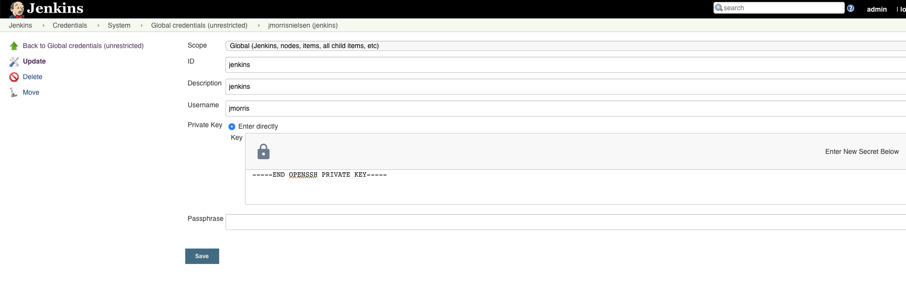
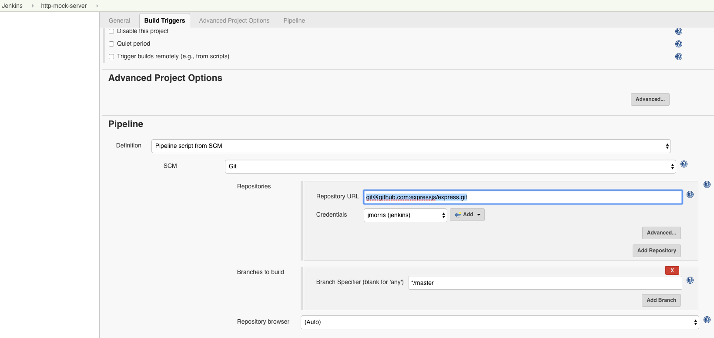

# Local Jenkins
Run Jenkins with a single Ubuntu slave locally, this is useful when you don't have cloud Jenkins access and for testing things.

## Prerequisites
 - [Docker Engine](https://docs.docker.com/docker-for-mac/install/)
 - [docker-compose](https://docs.docker.com/compose/install/)

## Running
All you need to do is build and run, master-->agent configuration will be setup for you.
```shell
./build.sh # docker-compose build with key generation 
docker-compose up
```
## Extras
### Setting up SSH keys for Git
 1. Add the SSH public key (one is generated: `master/.ssh/id_rsa`) to your Git account 
 2. Add the SSH private key to your Jenkins credentials:
    
 3. Configure those credentials in your pipeline:
    
